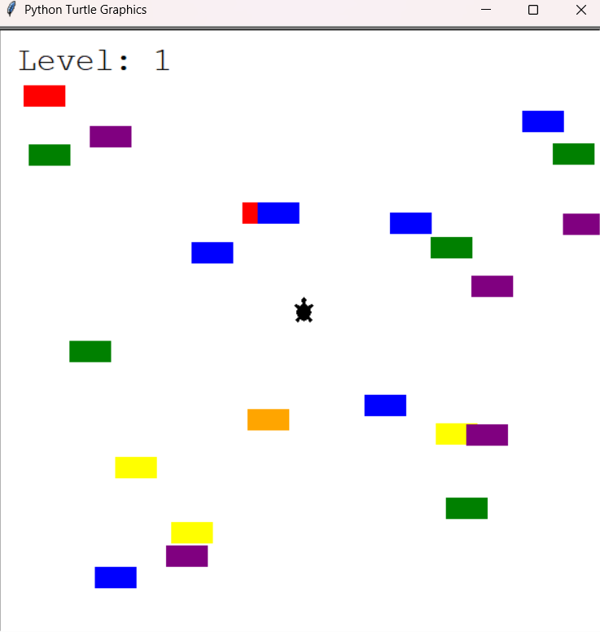

# 🐢 Turtle Crossing – OOP Mini Project

This is a simple Python game built with the `turtle` module to **practice and consolidate Object-Oriented Programming (OOP)** concepts.

The goal of the game is to move the turtle across the screen while avoiding moving cars. As you cross successfully, the level increases and the car speed accelerates.

---

## 🚀 How to Run

This project is **fully functional** and can be run immediately by executing the main file:

```bash
python main.py
```

Make sure you have Python 3 installed and the `turtle` module available (included in standard library).

---

## 🎯 Project Purpose

This mini-project was created to **better understand key OOP principles**, including:

- Classes and objects
- Inheritance
- Encapsulation
- Modular design
- Collision detection and event-driven input

---

## 📁 Project Structure

```
📁 project_root/
├── main.py           # Main game logic and loop
├── player.py         # Player turtle class
├── car_manager.py    # Car generation and movement
├── scoreboard.py     # Level tracker and game over message
├── README.md
```

---

## 📸 Game Interface

Below is a screenshot of the game running:



---

## 🧠 What I Learned

Through building this project, I reinforced the following:

- How to use inheritance and method overriding
- Creating clean, reusable components
- Managing state and events in a simple game loop
- Structuring a Python project across multiple modules

---
